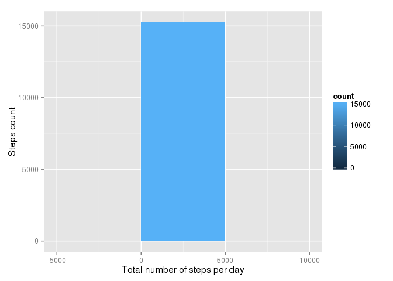

# Reproducible Research: Peer Assessment 1


## Loading and preprocessing the data

```r
library(magrittr)
library(readr)
library(dplyr)
library(ggplot2)

activity <- read_csv("activity.csv", col_types = list(col_integer(), col_date(), col_integer()))
activitybyday <- activity %>%
      group_by(date) %>%
      summarize(stepstotal = sum(steps))
```

## What is mean total number of steps taken per day?

```r
activitybyday %>%
      ggplot(aes(x=stepstotal)) +
      geom_histogram(binwidth = 5000, aes(fill=..count..)) +
      labs(x = "Total number of steps per day", y = "Steps count")
```

 

```r
summary(activitybyday)
```

```
##       date              stepstotal   
##  Min.   :2012-10-01   Min.   :   41  
##  1st Qu.:2012-10-16   1st Qu.: 8841  
##  Median :2012-10-31   Median :10765  
##  Mean   :2012-10-31   Mean   :10766  
##  3rd Qu.:2012-11-15   3rd Qu.:13294  
##  Max.   :2012-11-30   Max.   :21194  
##                       NA's   :8
```

```r
activitybyday_mean <- summarize(activitybyday, mean = mean(stepstotal, na.rm = TRUE)) %>%
      as.matrix() %>%
      as.vector() %>%
      as.integer()
activitybyday_median <- summarize(activitybyday, median = median(stepstotal, na.rm = TRUE)) %>%
      as.matrix() %>%
      as.vector()
print(paste("Mean of total number of steps per day (integer): ", activitybyday_mean))
```

```
## [1] "Mean of total number of steps per day (integer):  10766"
```

```r
print(paste("Median of total number of steps per day (integer): ", activitybyday_median))
```

```
## [1] "Median of total number of steps per day (integer):  10765"
```

## What is the average daily activity pattern?


## Imputing missing values


## Are there differences in activity patterns between weekdays and weekends?
